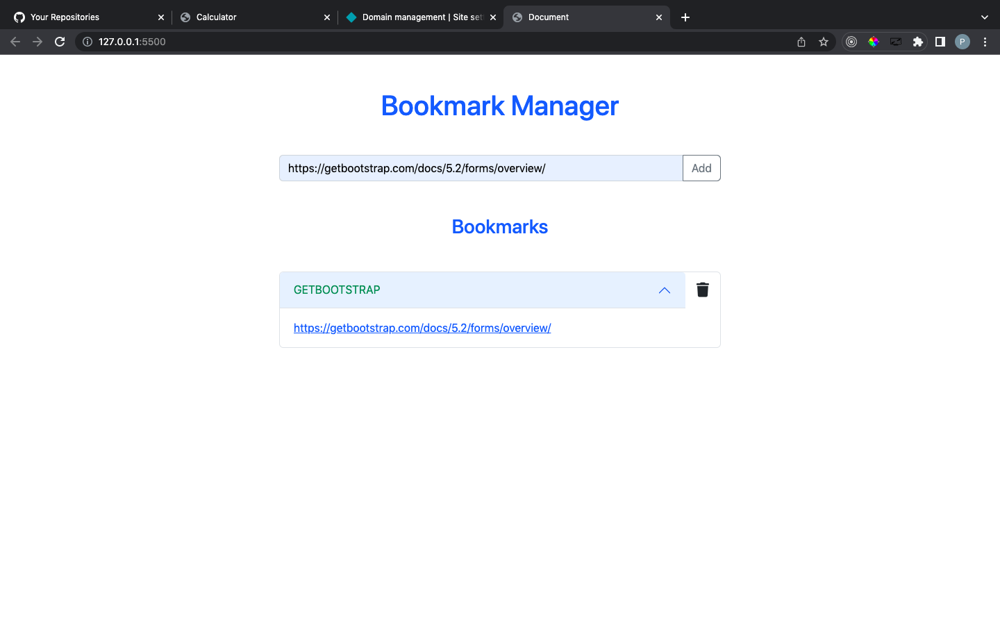

# Project - **BOOKMARK MANAGER with javascript**

## **Overview of the Project** 

- Project is Build using javascript and Bootstrap.

### **What did I learn from this Project?**

 - Bootstrap classes using javascript
 - Regular Expressions
 

---

### **Time Duration to Build the Project:-**

- It took me around 3 hours to Build Website. 

---

## **About me**

#### **Hey, I'm Piyush Umale**

- I live in Nagpur, Maharashtra. I'm on a journey to learn Full Stack Web Development.

---

## **Feedback**
- Feedbacks are always appreciated. piyush7uml@gmail.com